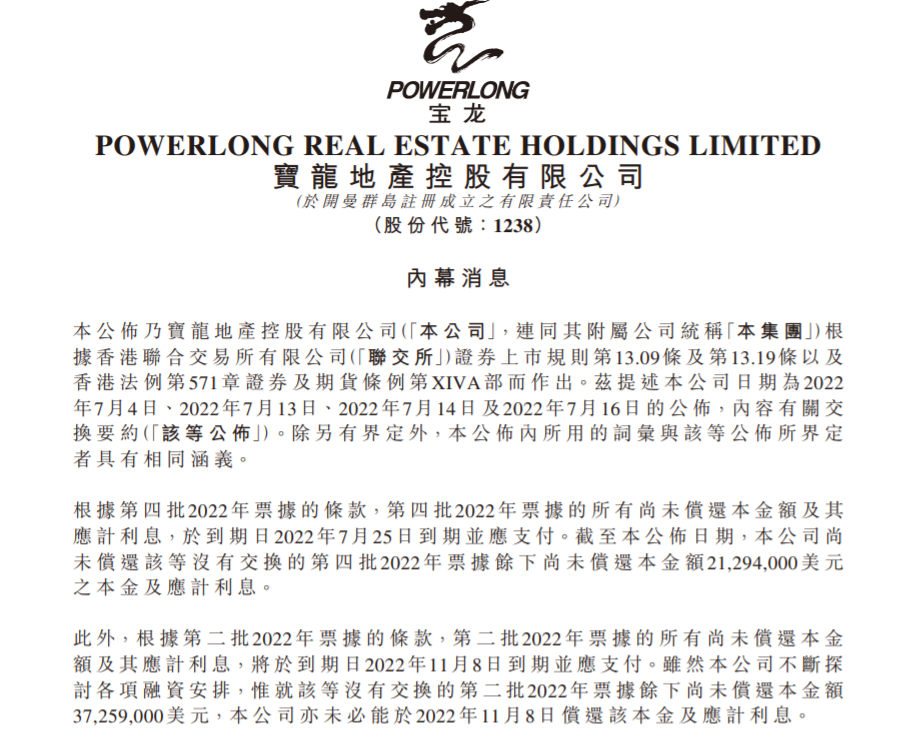
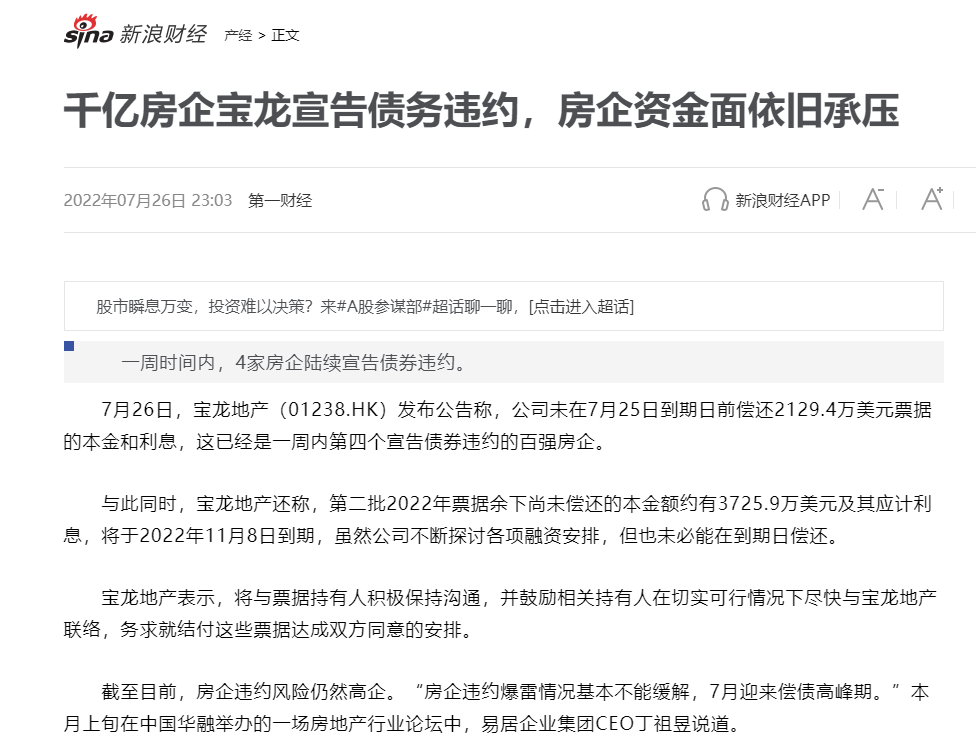
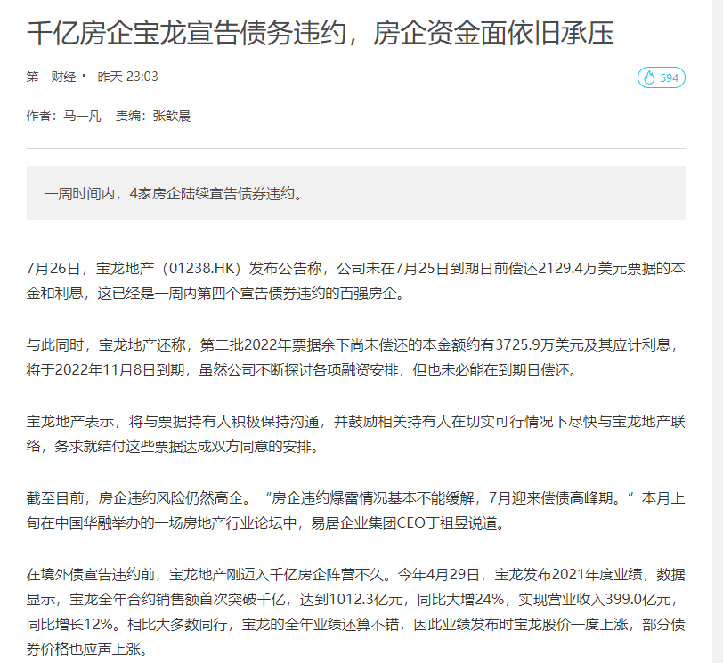

# 宝龙地产正式宣告违约

不动产资管界 [不动产资管界](javascript:void(0);) *2022-07-26 09:53* *发表于上海*

7月26日，宝龙地产披露内幕消息称，根据第四批2022年票据的条款，**第四批2022年票据的所有尚未偿还本金额及其应计利息，于到期日2022年7月25日到期并应支付**。截至公布日期，宝**龙地产尚未偿还该等没有交换的第四批2022年票据余下尚未偿还本金额2129.4万美元本金及应计利息。**

据悉，宝龙地产进一步表示，根据第二批2022年票据的条款，第二批2022年票据的所有尚未偿还本金额及其应计利息，将于到期日2022年11月8日到期并应支付。虽然宝龙地产不断探讨各项融资安排，惟就该等没有交换的第二批2022年票据余下尚未偿还本金额3725.9万美元，亦未必能于2022年11月8日偿还该本金及应计利息。

值得注意的是，宝龙地产将与余下的第四批2022年票据及第二批2022年票据的持有人积极保持沟通，并鼓励相关持有人于切实可行情况下尽快与公司联络，务求就结付该等票据达成双方同意的安排。

## **债务集中到期**

据YY评级报告，宝龙今年6-12月还有45.15亿元境内债（含ABS）+6亿美元境外债面临行权或到期，折合人民币约85亿元。

集中兑付压力下不容喘息，在销售下滑的不利背景下，特别是80余亿元REITS发行失效后，宝龙拿出了新的融资及偿债计划：1）出售写字楼和长期出租公寓（价值150-200亿元）；2）抵押39个购物商场和酒店（价值200-250亿元）。

此外，宝龙在融资动作上也并不顺利。

2月22日，据上交所披露，宝龙地产旗下上海宝龙实业发展(集团)有限公司20亿元ABS项目状态更新为“终止”。据了解，该债券拟发行金额为20亿元，债券名称天风-瑞龙应收账款1-10期资产支持专项计划。

也就是说，这次ABS的底层资产是宝龙实业对外的应收款。

据了解，这是宝龙地产一年来发生的“第N次”公开融资受挫。

去年10月8日，上海宝龙实业发展（集团）有限公司的公募债券被证监会中止审查；去年4月，宝龙地产旗下一笔ABS同样也被上交所终止；

去年3月原定发行不超过20亿元公司债，最终实际发行规模为15亿元；去年1月份，宝龙地产计划发行上限为25亿元的公司债，最终发行规模仅为10亿元等等。

## **评级被下调**

7月5日，**穆迪将宝龙地产控股有限公司(Powerlong Real Estate Holdings Limited，简称“宝龙地产”)的公司家族评级从“Caa1”下调至“Caa2”，高级无抵押评级从“Caa2”下调至“Caa3”。**

此外，展望仍为“负面”。穆迪副总裁兼高级分析师Cedric Lai表示:“评级下调反映出，随着宝龙地产向其票据持有人提出交换要约以及同意征求，该公司流动性风险加大。”

Cedric Lai还补充道：“负面展望反映出，在融资紧张的环境下，该公司解决再融资需求的能力存在不确定性。”

2022年7月4日，宝龙地产向其将于2022年7月和2022年11月到期的美元高级票据持有人提出交换要约以及同意征求。

交换要约中提及，在经营环境困难、融资条件紧张和大量债务到期的情况下，该公司的流动性承压，其中包括了将于2022年12月底前到期的6亿美元离岸债券。该公司还有4.2亿美元的离岸债券和94亿元人民币的在岸债券将在2023年底前到期或可回售。

宝龙地产的Caa2公司家族评级反映了该公司的流动性疲弱，穆迪预计，由于融资条件受限，该公司将难以从在岸和离岸债券市场筹集新资金，以解决其再融资需求。

虽然宝龙地产的投资物业组合可以提供一定的流动性来源，但此类资产出售将受到市场状况波动的影响。

由于结构性次级风险，宝龙地产的高级抵押债务评级Caa3相较其公司家族评级要低一个子级。上述风险反映了宝龙地产的大部分债权在运营子公司层面，在破产情况下其受偿顺序优先于宝龙地产的高级无抵押债权。此外，控股公司缺乏缓解结构性次级风险的重大因素，因而降低了控股公司层面债权的预期回收率。

在环境、社会和治理(ESG)因素方面，穆迪考虑了该公司对其控股股东许健康及许华芳的集中所有权，截至2021年12月31日，许健康及许华芳共同持有该公司59%的股份。穆迪还考虑了公司设立专门委员会进行监督，其审计和薪酬委员会由两名独立非执行董事担任主席;以及适用中国香港特别行政区的《香港证券交易所上市规则》和《证券与期货条例》，以监督关联交易。

